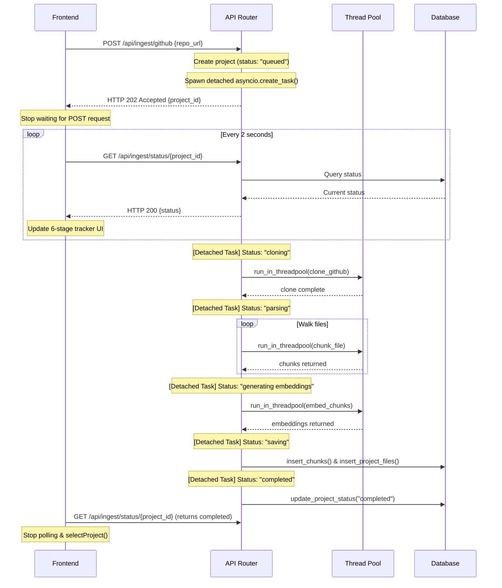

# GitSense AI Ingestion and Indexing Flow Report

This report outlines the investigations, diagnosis, and resolutions applied to correct the asynchronous repository ingestion flow, resolving the Axios 60-second timeouts.

## 1. The Current Bug
Previously, when the frontend initiated repository ingestion via a `POST /api/ingest/github` request:
- The backend scheduled cloning and the indexing pipeline using FastAPI's default `BackgroundTasks` handler.
- However, the indexing pipeline is heavily CPU-bound: it walks the local directories, performs AST parsing and chunking, and generates `SentenceTransformer` vector embeddings locally on the CPU.
- Because both the background tasks and the main route handlers run in the single Python process thread, these synchronous, CPU-heavy tasks blocked the FastAPI/Uvicorn event loop completely.
- As a result, Uvicorn was unable to flush the initial `202 Accepted` response bytes back to the TCP socket, and subsequent polling requests to `GET /api/ingest/status/{project_id}` were queued indefinitely.
- The frontend Axios request remained open and eventually timed out after the configured 60 seconds limit.

## 2. The Correct Asynchronous Flow
To establish a fully non-blocking asynchronous architecture, the ingestion flow has been redesigned as follows:

### Key Technical Improvements:
1. **Detached Scheduling**: Instead of using FastAPI's standard `BackgroundTasks` (which can hold references and delay TCP socket close), we schedule the ingestion pipeline via `asyncio.create_task()`. The `POST` route returns the `202 Accepted` response immediately and the connection is closed.
2. **Threadpool Offloading**: All heavy synchronous CPU-bound computations (`chunk_file` parsing and `SentenceTransformer` inference) are wrapped inside `run_in_threadpool` calls. This frees the main event loop thread to process incoming request sockets, including the frontend's status polling requests.
3. **6-Stage Status Progression**: The project status column in the database progresses through the following statuses to support detailed progress tracking in the UI:
   - `queued`: Request received and scheduled.
   - `cloning`: Shallow git cloning of the repository (or extraction for zip).
   - `parsing`: AST syntax parsing and chunking of codebase files.
   - `generating embeddings`: Local LLM embedding model inference on text/code chunks.
   - `saving`: Bulk writes inserting vector chunks and file paths to the PostgreSQL database.
   - `completed` / `failed`: Pipeline completion states.

---

## 3. Files Modified

### Backend

1. **[backend/app/api/routes_ingest.py](file:///d:/projects/GitSense_Ai/backend/app/api/routes_ingest.py)**
   - Switched to `asyncio.create_task()` to start the process asynchronously.
   - Set status to `"cloning"` before calling cloning/extraction helper utilities.

2. **[backend/app/core/rag_pipeline.py](file:///d:/projects/GitSense_Ai/backend/app/core/rag_pipeline.py)**
   - Added imports for `run_in_threadpool` from `fastapi.concurrency`.
   - Modified `run_indexing_pipeline()` to yield status updates: `"parsing"`, `"generating embeddings"`, and `"saving"`.
   - Wrapped `chunk_file()` and `embedder.embed_chunks()` in `run_in_threadpool()` calls to offload the event loop.

### Frontend

3. **[frontend/src/pages/ChatPage.tsx](file:///d:/projects/GitSense_Ai/frontend/src/pages/ChatPage.tsx)**
   - Added React state `lastActiveStatus` to track progress checkpoints during failures.
   - Rewrote the `useEffect` polling callback to request ingestion status every 2 seconds.
   - Handled `completed` state by fetching project details, selecting the newly indexed project to automatically open the chat panel, and closing the overlay.
   - Handled `failed` state by stopping the poll, displaying the backend error message, and displaying a manual close button.
   - Designed a responsive 6-step progress checklist for the UI.
